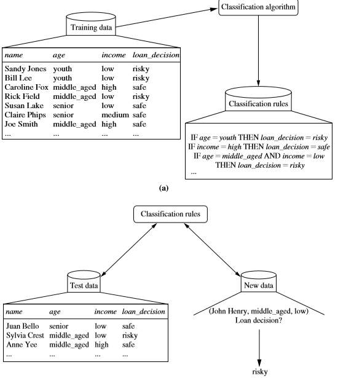
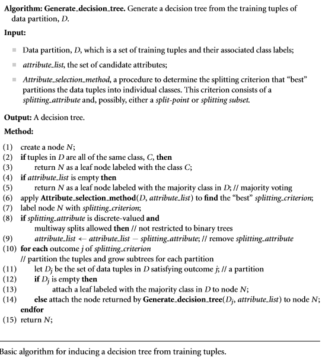
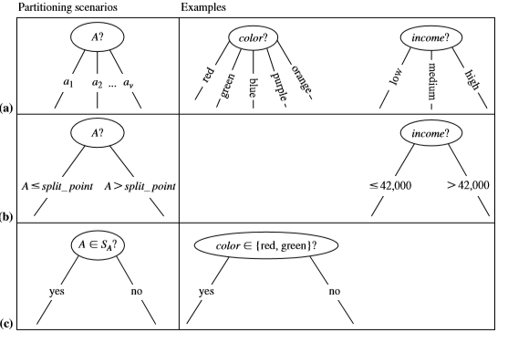

Classification
==============
- Classification:	Form of data analysis that extracts models describing important data classes.
- Classification model:	Such models, called classifiers, predict categorical (discrete, unordered) class labels. For example, we can build a classification model to categorize bank loan applications as either safe or risky
- Data classification:	
- Decision tree induction: Leaf nodes siger ja/nej og hver node har et spørgsmål som vil fører en tuple X igennem træet tile n leaf node rammes og en klassifisering kan vælges.
- ID3
    

Training data + classification algorithm -> classification rules
Classification rules tests på “test data” ->  klassifisere reglerne stadig data’en korrekt?

Attribute selection measures:
Split up into partitions (preferably pure) according to the outcomes of the splitting criterion.
