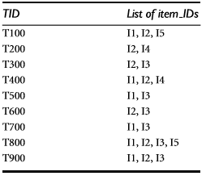
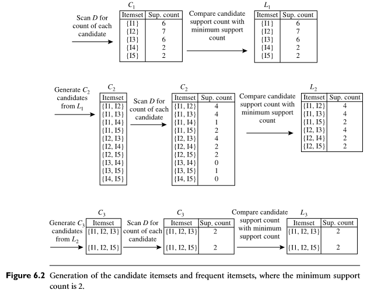
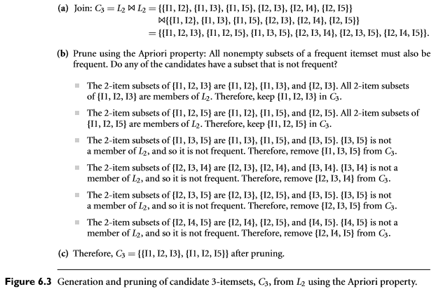
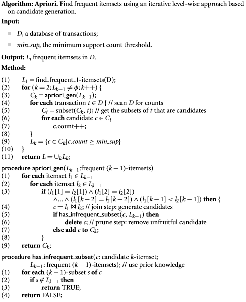
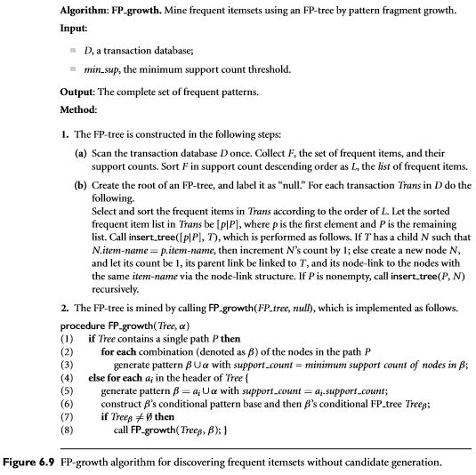

Pattern Mining 1
================

D = dataset.

#Math primer sets
- Collectino of **distinct** objects.
- ex. A = {1,2,3,4,5}
- Cardinality = size, ie. |A| = 5
- Union (∪) Every element part of either A or B
- Intersect () Every element part of both A and B.
- P(B|A) is the conditional probality of B and A.

#Frequent pattern mining
Frequent pattern mining searches for recurring relationships in a given data set.

**Market basket analysis.**: We want to analyze which items are are frequently bought in the same transaction.
More formally put, we want to find regularities in data. "What product are often purchased together?" is just a case example.

 This is done by calculating `Association rule`.
These are rules saying if a customer buys itemset I1, he's likely to also by itemset I2.

- `Association rule` Example with itemsets of size 1 `computer => antivirus software [support=2%,confidence=60%]`. Generally written `A => B [Support=x%, confidence=y%]`
- `Support`:  A support of 2% means that 2% of all the transactions under analysis show that computer and antivirus software are purchased together.
    - The domain of support are values between 0 and 100%, where 100% is the strongest.
    - support(A=>B) = A ∪ B / Count_total
- `Confidence`:  A confidence of 60% means that 60% of the customers who purchased a computer also bought the software.
    - The domain of confidence are values between 0 and 100%, where 100% is the strongest.
    - support(A=>B)/support(A)
- Rules are interesting if they satisfy  `minimum support threshold` and a `minimum confidence threshold`.
- Thresholds are set by users or domain experts. 
- Rules are said to be **strong** if they satisfy both a minimum support threshold and a minimum confidence threshold.

##Frequent Itemsets
Itemsets above the support and confidence threshold. These can be used to generate association rules. This is done by the following process:

>1. Find all frequent itemsets.
>2. Generate strong association rules from the frequent itemsets. 

- An itemsets containing k items are called `k-itemset`.
- `frequency` / `support count` / `count` of an itemset is the number of transactions that contain the itemset.
- An itemset is `infrequent` if it has a frequency lower than the minimum support threshold. 
- `absolute support` is the actual number of items while `relative support` is the percentage of transactions containing the itemset.
- The set of frequent k-itemsets is commonly denoted by LK.
- An itemset X is `Closed` in a dataset D if there exists no proper super-itemset Y such that Y has the same support count as X in D.
- An itemset X is `maximal frequent itemset` in a dataset D if X is frequent and there exists no superset Y such that X ⊂ Y and Y is frequent in D.
 
##Apriori Algorithm
**Purpose**: Finding frequent itemsets by confined candidate generation by an iterative approve.

1. Find 1-itemsets by scanning the dataset D to accumulate the count of each item and discard items not reaching the minimum support threshold.
    - The resulting set is labelled L1
2. L1 is used to find L2. L2 used to find L3 and so on.

The finding of each Lk requires a ful scan of the dataset D.
  
- `Apriori property`: All nonempty subsets of a frequent itemset must also be frequent.
    -  Used to reduce the search space. 

###Steps

1. **The join step**: To find Lk, a set of candidate k-itemsets is generate by joining Lk-1 with itself.
    - Apriori assumes items within a transaction or itemset are sorted in lexicographic order.
    - Make sure no duplicates are formed from joining Lk-1 with Lk-1. This is done by only joining values where every item in itemset1 is the same as itemset2 except the last one.
2. **The prune step**: Ck is a superset of Lk . The members of Ck may or may not be frequent but all frequent members of Lk is included in Ck.
    - Scan database to get all the count of each candidate in Ck.
    - Lk is given by filtering out members of Ck with a count lower than the minimum support threshold.
    - Ck can be huge so to reduce it the apriori property is used.
        - If any (k-1)-subset of candidate k-itemset is not in Lk-1 then the candidate cannot be frequnt either and can be removed from Ck.
        - Implementations can use hash tree to make this test fast.
        
Example:

Data:  

Example:  

Join:  

Pseudo code:  

##Generating association rules from frequent itemsets
Since we're using only items from frequent itemsets, each one automatically satisfies the minimum support. 
Now there's just left to find the rules also satisfying the minimum confidence threshold. 

More generally:
>1. For each frequent itemset l, generate all nonempty subsets of l.
>2. For every nonempty subset s of l, output the rule “s => (l−s)” if support_count(l)/support_count(s) ≥ min_conf, where min_conf is the minimum confidence threshold.

##Improving the apriori algorithm
These are a tradeoff between accuracy and performance.

- Hash-based technique: ...
- Transaction reduction: Remove transaction that contains no k-itemsets. (they wont have (k+t)-itemsets either)
- Partitioning: Make partitions that can be contained in memory.
- Sampling: ...
- Dynamic itemset counting: ...

##Mining using vertical data format.
Until now we've worked on `horizontal data format` with a set of transactions containing itemsets.  
Another approach is using `vertical data format`. That is having set of items containing a transactionset.

Finding itemsets that share transaction is as simple as taking the intersection between them.

Example:  

- Can be improved using `diffset` on items since the transaction set of each item often gets very large. 

##Pattern evaluation
- Chi-squared test (Introduced in preprocessing)
- Lift
- All_confidence
- Max_confidence
- Kulczynski
- Cosine measures

The last four are
- only influenced by A and B and does not care about the size of the total dataset.
- Yielding results between 0 and 1

Null-transaction: A transaction that does not contain any of the itemsets undergoing correlation analysis.
Null-invariance
- A correlation measure is said to be null-invariant if its vlaue is free from the influence of null-transaction
- The last four measures are all null-invariant.

IR measures imbalance between two itemsets.

The book recommands using Kulczynski together with IR.

####Notes missing:
- partioning apriori approach
- FP_tree
- Eclat
- two-level hash index structure
- x2 (chi squared)

