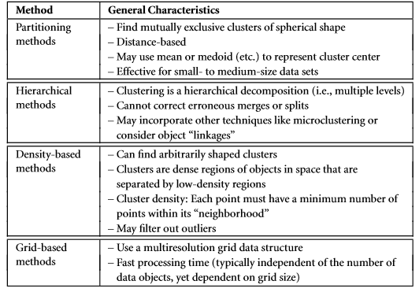
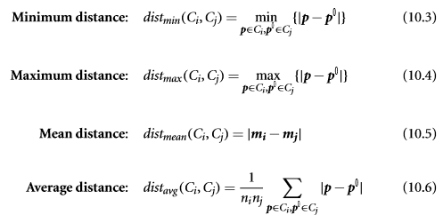

Custering
=========

## By Partitioning
- Partitioning
    - Formally, given a data set, D, of n objects, and k, the number of clusters to 
    form, a partitioningalgorithm organizes the objects into k partitions (k≤n)
    - Suppose a data set, D, contains n objects in Euclidean space. 
    Partitioning methods distribute the objects in D into k clusters, C1,...,Ck, 
    that is, Ci ⊂D and Ci∩Cj =Ø for (1≤i,j≤k). 
    - Each partition represents a cluster
    - Methods:
        - k-means
        - k-medoids (Partitioning Around Medoids)
            - Sampling based (Clustering LARge Applications)
            
## By Hierarchical
- you may organize your employees into major groups such as executives, managers, 
and staff. You can further partition these groups into smaller subgroups. 
For instance, the general group of staff can be further divided into subgroups 
of senior officers, officers, andtrainees.Allthesegroupsformahierarchy
    - Methods
        - Agglomerative (bottom-up)
            - start with individual objects as clusters, which are iteratively merged to form larger clusters
        - Divisive (top-down) 
            -  initially let all the given objects form one cluster, which they iteratively split into smaller clusters
- algorithmic methods
    - Agglomerative, Divisive, multiphase (i.e. Agglomerative merged with another method)
    - meaning they consider data objects as deterministic and compute clusters according to the deterministic distances between objects 
- probabilistic methods
    - use probabilistic models to capture clusters and measure the quality of clusters by the fitness of models
- Bayesian methods
    - instead of outputting a single deterministic clustering over a data set, they return a group of clustering structures and their probabilities, conditional on the given data
    - Not discussed further in the book
    
### algorithmic methods
- agglomerative
    - AGglomerative NESting
- divisive
    - DIvisive ANAlysis
- Distance measures
    - They are also known as linkage measures.

- Balanced Iterative Reducing and clustering using Hierarchies (BIRCH)
    -  is designed for clustering a large amount of numeric data by integrating hierarchical clustering (at the initial microclustering stage) and other clustering methods such as iterative partitioning (at the later macroclustering stage).
    - CF-tree (cluster features)
        - CF = {n, LS, SS}
            - n = number of d-dimensional data objects or points
            - LS = Linear sum of the linear sum of the n points 
            - SS =  the square sum of thedata point
            - Possible to calculate lots of interesting features for a cluster
                - i.e. radius (average away from mean), diameter (average between two points) and centoid

- Chameleon: Multiphase Hierarchical Clustering Using Dynamic Modeling 
    - based on 
        1. how well connected objects are within a cluster 
        2. the proximity of clusters.
    - two clusters are merged if their interconnectivity is high and they are close together. Thus, Chameleon does not depend on a static, user-supplied model and can automatically adapt to the internal characteristics of the clusters being merged

- Probabilistic Hierarchical Clustering 
