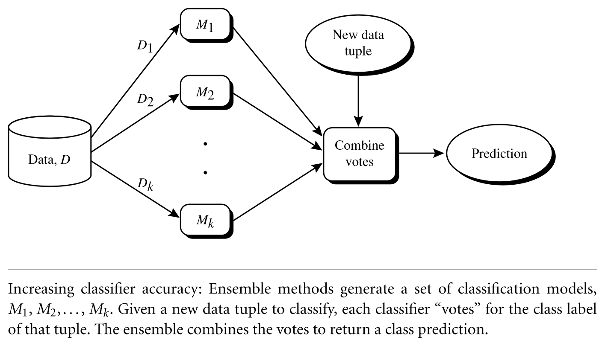

## Ensemble methods

- Use multiple classifiers and use the class most picked for each tuple
- Methods:
    - Bagging
        - Majority vote
    - Boosting
        - Assign weight or worth to each classifier based on accuracies of previous tuples
        - Final decision is based on weight and vote
        - Weight assigned to
        - Example: AdaBoost
            - If a tuple was incorrectly classified, its weight is increased. 
            If a tuple was correctly classified, its weight is decreased. 
            A tuple’s weight reflects how difficult it is to classify— the higher the weight, 
            the more often it has been misclassified
            - When we build classifiers we want it to focus on the misclassified tuples from the previous iteration.
            - Some classifiers may be better at classifying some “difficult” tuples than others. In this way, we build a series of classifiers that complement each other. 
            - Use training set where initially every tuple has an equal weight of 1/d (size of dataset)
            - Vote based but each classifiers vote is weight dependent. That is, the more accurate a classifier is, the more it's vote count
            - Might overfit because it focus on misclassified tuples which would also be the outliers.
                - Even with this consideration boosting still tends to achieve greater accuracy then bagging.
    - Random forest
        - "forest" in that each classifier is a decision tree.
        - "Random" in that it selects a random set of attributes at each node to determine the split
        - Each tree votes and the majority wins
        - Random forests are comparable in accuracy to AdaBoost, yet are more robust to errors and outliers. 
        The generalization error for a forest converges as long as the number of trees in the forest is large. 
        Thus, overfitting is not a problem. 
        - Because random forests consider many fewer attributes for each split, they are efficient on very large databases. 
        They can be faster than either bagging or boosting
        
## Class imbalance
- Oversampling
    - Original traningset is 100 positive tuples and 1000 negative
        - Increase trainingset to 1000 positive and 1000 negative
- Undersampling
    -  Original traningset is 100 positive tuples and 1000 negative
        - decrease trainingset to 100 positive and 100 negtive 
        

## Lecture - cluster

- Unsupervised proces
- Good clustering:
    - High intra-class simlularity
    - low inter-class simulatiry
- dissimilarity/similarity metrics:
    - distance function (between two items)
        - depend on the datatype (bool? numeric?)
- Requirements:
    - Scalability
    - ability to deal with different types of attributes
        - numerical
        - binary
        - nominal, ordinal
        - mixed types
    - Dynamic data
    - cluster Shape
    - Noise/outliers
    - Shouldn't depend on input order of input records
    - high dimensionality
    - Incorporation of user-specified constaints
    - interpretability and usability
    - ... (slides)
- Goal: how simular are tuples?
    - Dissimilarity matrix
- Normalize before using clustering algorithm (length, weight to 0..1).
    - z-score
- Manhatten distance (pytagoras)
- variable distance:
    - binary
        - hamming
            - count the distance.
    - nominal
        - Simple matching
            - Is this 1 yellow and is 2 yellow?
    - Mixed types:
        - weighted formula to calculate distance 