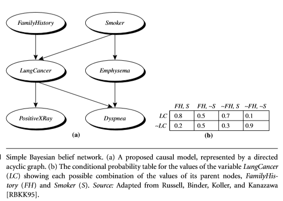

===
- Bayesian classifiers (cph. 8.3)
    - Bayesian classifiers are statistical classifiers. 
     They can predict class membership probabilities such as the probability that a given tuple belongs to a particular class. 
    - Bayesian classifiers assume class conditional independence. 
        - That is if the occurrence of one does not affect the probability of the other.
- Bayes' Theorem
    - "evidence"
    - P(H|X)
        - H: hypothesis
        - X: data tuple
        - posterior probability of H conditioned on X.
        - example:
            - X is a 35-year-old customer with an income of $40,000 
            - Suppose that H is the hypothesis that our customer will buy a computer. 
            Then P(H|X) reflects the probability that customer X will buy a computer given that we know the customer’s age and income
    - P(H)
        - prior probability of H
        - probability that any given customer will buy a computer, regardless of age, income, or any other information, for that matter
    - P(X)  
        - prior probability of X
        - Using our example, it is the probability that a person from our set of customers is 35 years old and earns $40,000
    - theorem:
        - P(H|X) = P(X|H) * P(H) / P(X)
- Naïve Bayesian classification (NBC)
    - Hvor sandsynligheden for en klasse er højst forventer NBC at X skal placeres.
    - formelt: P(Ci|X) > P(Cj|X) for 1≤j≤m,j!=i.
        - Ci.. Cm er mulige classes
        - Den højeste kaldes også "maximum posteriori" 
        - If the class prior probabilities are not known, then it is commonly assumed that the classes are equally likely
        - Note that the class prior probabilities may be estimated by P(Ci)=|Ci,D|/|D|, where|Ci,D|is the number of training tuples of class Ci in D

- Bayesian belief network (9.1)
    - unlike naïve Bayesian classifiers, allow the representation of dependencies among subsets of attributes.
    - A belief network is defined by two components—a directed acyclic graph and a set of conditional probability tables (CPT)
    
    
    
    !! lookup
    - Learning the dependencies via an iterative approach.
    - aka adaptive probabilistic networks
    - gradient descent

- Generalized sequence pattern (GSP)
    - candidate generation
        - join/prune phase
    - counting candidates
        - hash-tree to reduce the number of candidates that are checked for data-sequence.
        - transform the representation of the data-sequence d so that we can efficiently find whether a specific candidate is a subsequence of d.
    - contains-test
        - forward phase
        - backward phase

- Frequent subgraph discovery (FSD)
    - 