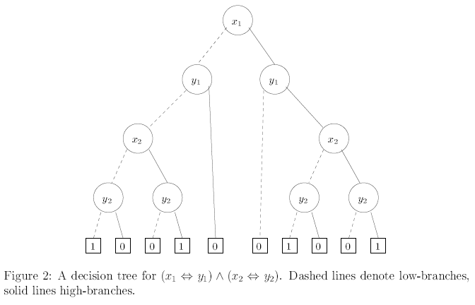
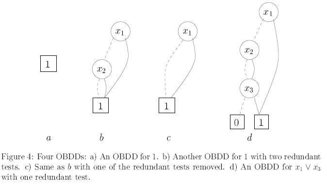
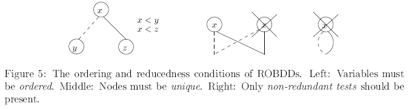
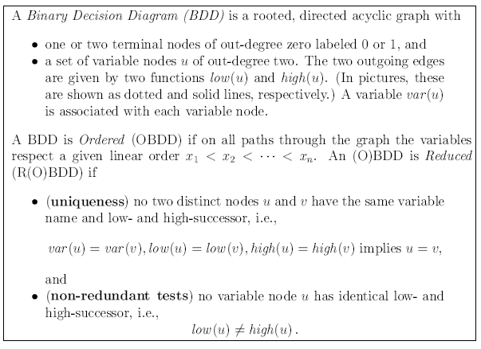

Binary decision tree
====================

### boolean functions:
- f: Bn -> B
    - B = domain
    - n = set of values from B
    - For binary this is the set {0, 1}
    - Number of boolean functions: 22n 
- i.e: f(x1,x2,x3) = x1 <=> -x2
    - x3 is not essential.
- functions f=g (are equal) iff for every x f(x) = g(x)
- Order of arguments input in functions matter.
    - i.e.: f(x,y) x => y != g(y,x) = x => y
- Canonicity: exactly one representation of each boolean function

### Normal form:
- `CNF` (Conjunction Normal Form): (X1 v Y1) ^ (X2 v Y2)
    - **Easy** to compute if **tautology**
    - **Hard** to compute if **Satisfiable**
- `DNF` (Disjunction Normal Form): (X1 ^ Y1) v (X2 ^ Y2)
    - **Head** to compute if **tautology**
    - **Easy** to compute if **Satisfiable**
- NP-hard to convert from CNF to DNF and vice versa.

### Binary Decision Diagram (BDD):
- if-then-else boolean operator:
    - x -> y1, y0 = (x ^ y1) v (-x ^ y0)
        - x -> y1, y0 [1/x] = (1 ^ y1) v (0 ^ y0) = y1
        - x -> y1, y0 [0/x] = (0 ^ y1) v (1 ^ y0) = y0
        - read: If x then y1 else y0
- All propositional logic can be expressed using only `->`
    - Examples: 
        - x = x -> 1,0
        - -x = x -> 0,1
        - x ^ y = x -> (y -> 1, 0), 0
        - x v y = x -> 1, (y-> 1, 0)
        - x => y = x -> (y -> 1,0), 1
            - Notice here that the order matters.
- Shannon expansion is the expansion of a boolean expression t resursively to INF (if-then-else Normal Form).
    - Formally: t = x -> t[1/x], t[0/x]
        - This resursion must terminate in 0 or 1, since the number of variables is finite.
    - Use this expansion to build up a tree (See figure below)
    

____________
### Figures
- low-son (false) = dashed lines
- high-son (true) = solid lines

