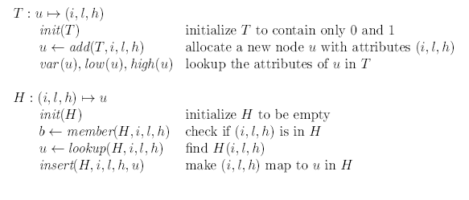
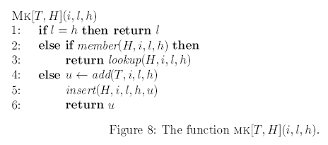
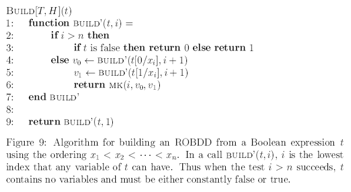
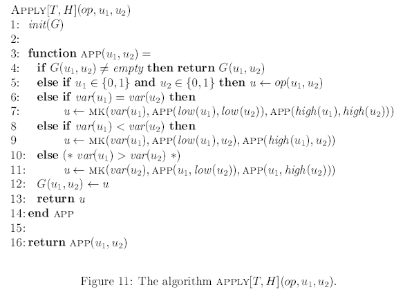
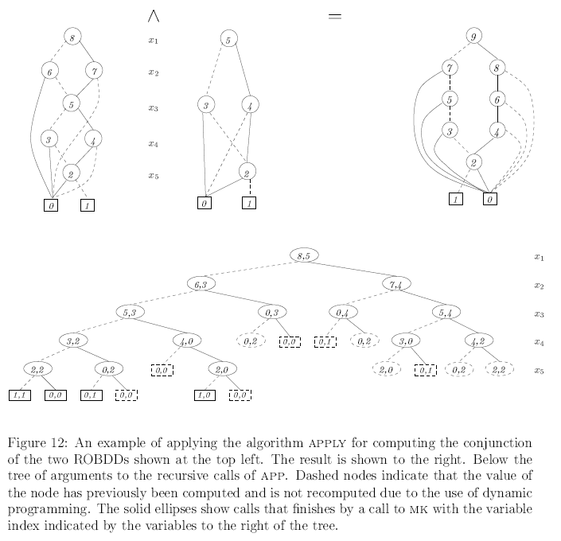

Binary decision tree 2 (cont.)
==============================
- A smarter way to cosntructing ROBDD's
    - Reduce decision tree during construction
    

- (i,l,h) is a triple describing:
    - i: index
    - l: low (false)
    - h: high (true)

#ROBDD Generation algorithm.

Visualized Apply:

